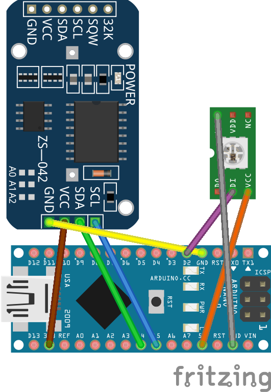
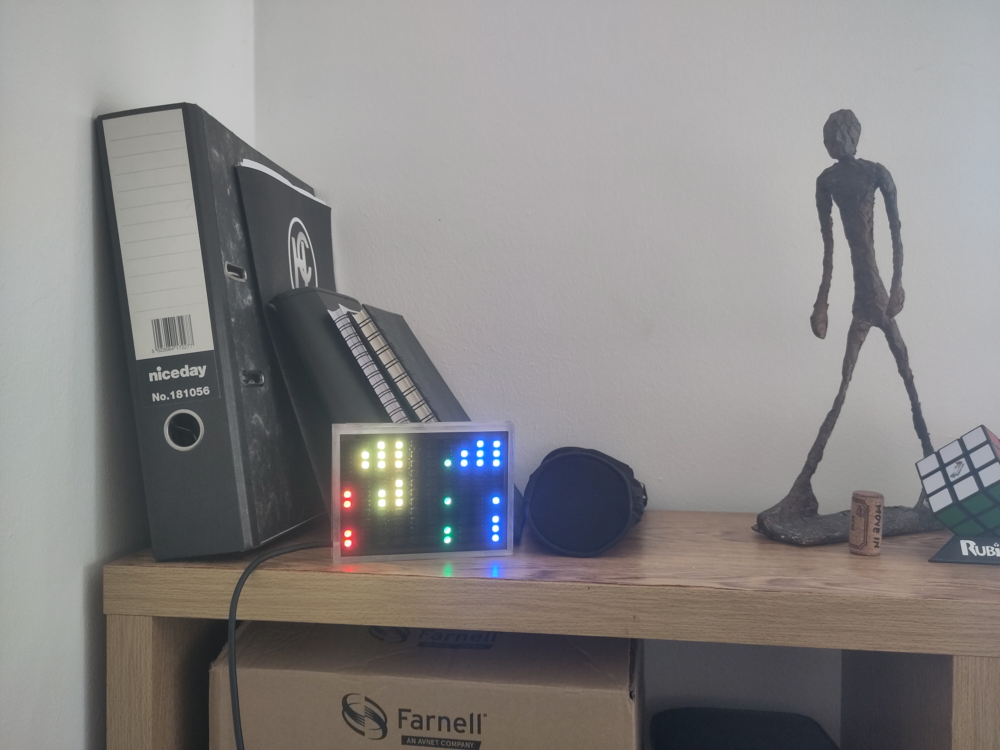

# led_strip_screen_rtc

Code to run a clock (HHMM) and calendar (ddmm yyyy) on a custom 110 LED panel made out of a strip of LEDs connected together in columns.

## Circuit

## LED layout

$${\color{red}\texttt{H}\color{yellow}\space\texttt{H}\color{green}\space\texttt{M}\color{blue}\space\texttt{M}}$$

$${\color{red}\texttt{d}\color{yellow}\space\texttt{d}\color{green}\space\texttt{m}\color{blue}\space\texttt{m}}$$

$${\color{red}\texttt{y}\color{yellow}\space\texttt{y}\color{green}\space\texttt{y}\color{blue}\space\texttt{y}}$$

## Example

2023-25-11 08:18

