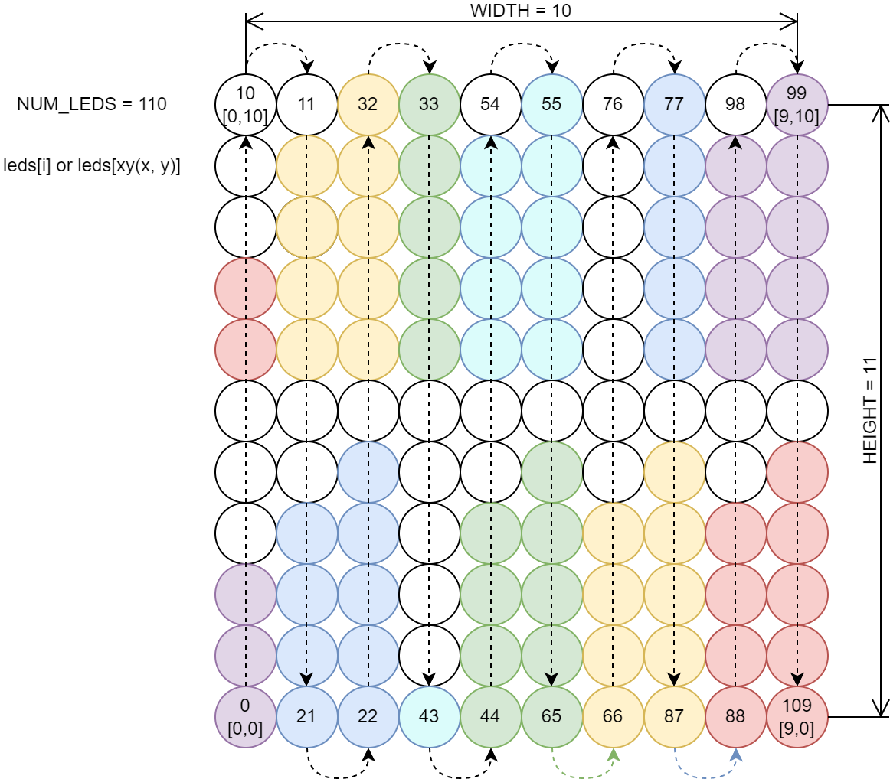

# led_strip_screen_rtc

Code to run a clock (HHMM) and calendar (ddmm yyyy) on a custom 110 LED panel made out of a strip of LEDs connected together in columns.

## Circuit

## LED layout

### With ${\texttt{\#define GRID\_2\_ROWS}}$

Display wraps around every 100 years.

$${\color{red}\texttt{H}\color{yellow}\space\texttt{H}\color{green}\space\texttt{M}\color{cyan}\space\texttt{M}\color{blue}\space\texttt{S}\color{purple}\space\texttt{S}}$$

$${\color{purple}\texttt{d}\color{blue}\space\texttt{d}\color{cyan}\space\texttt{m}\color{green}\space\texttt{m}\color{yellow}\space\texttt{y}\color{red}\space\texttt{y}}$$

### Without ${\texttt{\#define GRID\_2\_ROWS}}$

Display is accurate until the year 4000.

$${\color{red}\texttt{H}\color{yellow}\space\texttt{H}\color{green}\space\texttt{M}\color{blue}\space\texttt{M}}$$

$${\color{red}\texttt{d}\color{yellow}\space\texttt{d}\color{green}\space\texttt{m}\color{blue}\space\texttt{m}}$$

$${\color{red}\texttt{y}\color{yellow}\space\texttt{y}\color{green}\space\texttt{y}\color{blue}\space\texttt{y}}$$

## Example

### With ${\texttt{\#define GRID\_2\_ROWS}}$

08:47:13, 26/11/23

### Without ${\texttt{\#define GRID\_2\_ROWS}}$

08:18, 25/11, 2023

